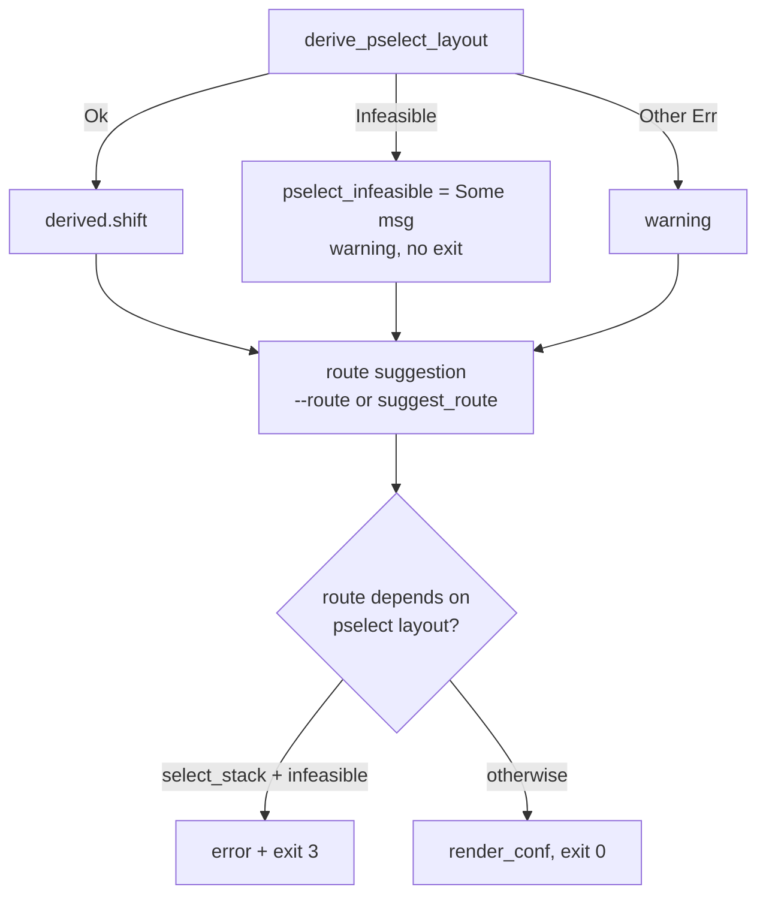

# 提取器 route 回退与 TCP probe 修复 计划（2026-10-01）

## 现状与基线

- 分支 `very-not-stable-dev`；对象是 `tools/extract_rs` 的 `--format conf` 路径。
- `derive_pselect_layout` 返回 `ExtractError::Infeasible` 时，`main.rs:436-438` 直接
  `return Ok(3)`，发生在 route 建议（`main.rs:567-576`）之前。
- 后果：
  - 6.1 的 `tcp_zerocopy` 回退（`analysis.rs:255-258`）永远不会执行；
  - 即使显式传 `--route tcp_zerocopy` 也被该分支拦截；
  - 与 `--analysis` 路径不一致——`analysis.rs:208` 把同一结果记为
    `PselectOutcome::Infeasible`，并不致命。
- 触发设备：`6.1.157-android14-11-o-g6d1e9edf2721`（OnePlus Nord CE 6 Lite，MTK）。
  日志：CVE-2026-43499 原语存在（`remove_waiter@0x10009c4` 未修复），但
  `futex waiter starts 13 qwords above the fd_set buffer`，`shift=13 > 3`，extract exit 3。
- 背景注释：Multicast、TCP、Select 三条路径均已由开发者真机验证（用户确认，2026-10-01）。

## 目标与约束

目标：pselect/futex 栈布局不可行不再等价于"该内核不支持"；只有当最终选中的 route
依赖该布局时才拒绝。

非目标：
- 不改 native 执行代码、不改 GLK1/profile 二进制格式、不改 wire、不改 app；
- 不为新的 family 增补 tcp 布局（`conf_route_geometry` 的 tcp 分支仍只认
  `STRUCT_OFFSETS_6_1`）；
- 不为 `shift=13` 扩展 pselect 可控窗口。

## 改动清单

| 文件 | 改动 | 理由 |
|---|---|---|
| `tools/extract_rs/src/analysis.rs` | 新增 `pub fn route_depends_on_pselect_layout(route: &str) -> bool`（`select_stack` 为 `true`）+ 单测 | 让"route 是否依赖 pselect 布局"成为可测的库事实，而不是散落在 `main` 的分支 |
| `tools/extract_rs/src/main.rs` | pselect `Infeasible` 由 fatal 降级为 `warning`，把消息存入 `pselect_infeasible` | 不可行只否定 `select_stack`，不否定整颗内核 |
| `tools/extract_rs/src/main.rs` | `pselect_shift` 的 family fallback 在 `pselect_infeasible` 时禁用（`None`） | 镜像已证明布局不成立，family 默认值会给出错误 shift |
| `tools/extract_rs/src/main.rs` | route 决策后终判：`route_depends_on_pselect_layout(route) && pselect_infeasible` → 原样输出 error 并 `return Ok(3)` | 保留"`select_stack` 不可行则拒绝"的既有语义 |
| `tools/extract_rs/src/derive.rs` | 新增 `pub fn tcp_zerocopy_receive_inlined()`：反汇编 `do_tcp_getsockopt`/`do_tcp_setsockopt`，确认直接 `bl tcp_zerocopy_vm_insert_batch` | `tcp_zerocopy_receive` 内联后符号消失，probe 需要功能判据 |
| `tools/extract_rs/src/analysis.rs` | `probe_paths` 增加 `kernel`/`rel_symbols`/`sorted_offsets` 参数；tcp 判据改为"符号命中 OR 内联确认" | 修正 false negative，见下节 |

不改的文件：`report.rs`（geometry 规则已正确）、native、Kotlin。

## 追加修复：TCP probe 内联漏判（2026-10-01）

**现象**：`boot-2.img`（`6.1.157-android14-11-o-gc2dad16af736`）的 `--analysis` 报
`path tcp_zerocopy missing`，但 native route 本应可用。

**证据**（extractor 实测，非符号表推断）：

- kallsyms 恢复完整（107662 符号），细粒度 `tcp_recvmsg_locked`、
  `tcp_zerocopy_vm_insert_batch`、`tcp_zerocopy_vm_insert_batch_error` 都在，
  唯独主函数 `tcp_zerocopy_receive` 不在。
- 反汇编 `do_tcp_getsockopt`（1019 条指令）：直接 `bl tcp_zerocopy_vm_insert_batch`
  （该 helper 只被 `tcp_zerocopy_receive` 调用）。optname 的比较用 `w` 寄存器，
  所以判据取直接调用，不依赖 `cmp xN, #0x15`。
- native `tcp_zerocopy_route.cpp:323` 正是 `getsockopt(..., TCP_ZEROCOPY_RECEIVE, ...)`。

**结论**：`tcp_zerocopy_receive` 被内联进 opt 处理函数，符号消失但功能保留；
`probe_paths` 仅按符号名判断产生 false negative。修复为"符号命中 OR 反汇编确认"。

## 数据流/控制流差异

旧：`Infeasible` → 立即 exit 3（任何 route / format）。
新：`Infeasible` → warning + 继续 → route 决策 → 仅当 route 为 `select_stack` 才 exit 3。

不变量：
- exit code 3 仍表示"所选 route 在该内核不可行"；
- profile 字段全集与 route 列表不变；
- `--no-disasm` 行为不变（不推导，也就没有 `Infeasible`）；
- 6.6/6.12 无 tcp 回退，pselect 不可行时 `suggest_route` 仍落 `select_stack`（family default）
  → 终判触达 → exit 3，与旧行为一致。

## 兼容性与回滚

- app 侧只按 exit code 处理（`GhostlockViewModel.kt:1438`），无需改动。
- 回滚：还原 `analysis.rs` 新增函数与 `main.rs` 三处改动即可，无持久化状态、
  无格式迁移。
- 真机门禁未过前，该 route 不得标 `supported`（沿用 §8.3/§8.4）。

## 验证矩阵

| 批次 | 命令 | 预期 |
|---|---|---|
| 单测 | `cd tools/extract_rs && cargo test --release` | 全绿；新增 `route_depends_on_pselect_layout` 用例 |
| 离线提取 | 对 `6.1.157-android14-11-o-g6d1e9edf2721` 运行 `--format conf` | route=`tcp_zerocopy`，`compact_waiter = 1`，exit 0；`pselect route not feasible` 降为 warning |
| 回归 | 对已知 6.6/6.12（pselect 不可行时） | 仍选 `select_stack` 并 exit 3 |
| probe 修复 | 对 `boot-2.img` 运行 `--analysis` | `path tcp_zerocopy available` |
| 真机门禁 | 冷机、固定 CPU 对、单 route `tcp_zerocopy`、KernelSU 未加载 | `route_done status=0`、`child is root!`、handoff；日志归档 `docs/analysis/device-gates/` |

## 明确保留

- native 核心路径、`kernelsnitch/`、`LegacyProfileConverter.kt`；
- `pselect_waiter_shift_for` 的 family 默认值（非 `infeasible` 路径仍使用）；
- profile 字段/route 列表与 `report.rs` 的 geometry 规则。

## 进度

- [x] 计划
- [x] 实施（`analysis.rs` + `main.rs`）
- [x] 单测（`cargo test --release`：38 passed；`cargo fmt --check` 干净）
- [x] 回归：`6.6.127-android15-8` `--format conf` → `select_stack` / `waiter_shift=-2` / exit 0
- [x] 离线提取（`boot-2.img` = `6.1.157-android14-11-o-gc2dad16af736`）：`--format conf` →
  `tcp_zerocopy` / `compact_waiter = 1` / exit 0；pselect 降为 warning。
  **发现**：该镜像 `tcp_zerocopy_receive` 符号缺失（`path tcp_zerocopy missing`），
  生成的 tcp profile 在本内核可能不可运行；且设备原版 build 为 `g6d1e9edf2721`，
  与下载镜像不同，需用设备导出的 `boot.img` 复验。
- [x] TCP probe 修复（`derive.rs` + `analysis.rs`）：`boot-2.img --analysis` → `path tcp_zerocopy available`
- [ ] 真机门禁（待设备）
