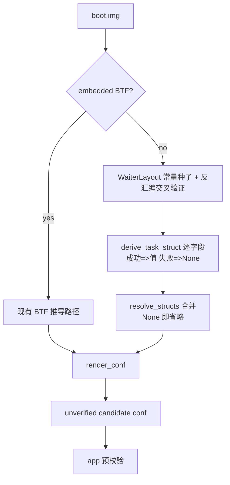

# 提取器无 BTF 结构推导计划（2026-09-30）

> 级别：L（提取器核心推导路径 + profile 字段契约）。按 `docs/development/documentation-standards.md` 模板。
> 关联 issue：YuKongA/ghostlock-app#213（OPPO A3x 5G / PKD130，`5.15.180-android13-8-o-g88bbcb96ee5e`，内核无 BTF）。

## 现状与基线

- 分支 `vr-ko-bypass-dev`，基线 commit `deff0b1`（Merge branch 'ancillary-architecture'）。
- 无 BTF 时 `resolve_structs(None)`（`tools/extract_rs/src/symbols.rs:147-161`）把 8 类结构约 25 个字段
  （`task_struct` 15、`rt_mutex_waiter`、`cred`、`seccomp`、`page`、`slab`、`mm_struct`）全部置 `None`。
- 现有反汇编推导全部以 BTF 为脚手架：
  - `derive_pselect_layout` 需 `rt_mutex_waiter.pi_tree` + `wake_state`（`derive.rs:450-458`）；
  - `derive_nf_logger_registration` 需 `nf_logger.type` 的类型与 4 字节宽度（`derive.rs:660-665`）；
  - `multicast_waiter_off` 的 waiter 字段来自 BTF（`derive.rs:968-979`）；
  - `derive_cred_5x` 需 `cred` 的 size / caps / 指针成员布局（`derive.rs:877-949`）。
- 但 `rt_mutex_waiter` 的关键偏移已被项目当作稳定 ABI：`main.rs:555` 硬编码
  `RT_MUTEX_WAITER_PI_TREE_ENTRY = 0x18` 供 multicast 推导，未走 BTF。
- `--format conf` 对缺失字段是"省略"（`report.rs:302-315`、`main.rs:482-504`），app 侧预校验拦截；
  提取器绝不用邻居 family 的猜测补齐（`README.md:46`）。

## 目标与约束

**目标**：无 BTF 时，用「ABI 常量种子 + 定向反汇编数据流推导」恢复 profile 所需结构字段，使
route 推导（`select_stack` / `multicast_waiter`）与 conf 字段契约在无 BTF 镜像上仍可产出
**unverified candidate**（语义不变，仍由 app 校验）。

**非目标**：

- 不做通用任意 struct 全反编译（不接受"把内核喂给反编译器再语义分析"这类研究级方案）。
- 不引入外部引擎（Ghidra/rizin/radare2）；不改变提取器自包含、可在 `aarch64-linux-android`
  设备端运行（`README.md:59-66`）的约束。
- 不改 GLK1/wire/profile 格式，不改 native 侧，不改 BTF 路径的既有行为。
- 不追求一次覆盖 100% 字段；每个字段独立可失败，失败即省略（沿用现有 candidate 语义）。

**约束**：

- 推导必须能对 vendor hook 改过的 `task_struct` 生效（issue 设备是 MTK OEM 内核）；
  因此不能套用 AOSP GKI 固定偏移，必须从目标镜像机器码取数。
- 真值验证优先用"有 BTF 镜像屏蔽 BTF 后与 BTF 真值逐字段对拍"，而不是只靠真机试错。

## 改动清单

逐文件（计划，非本轮实现）：

| 文件 | 改动 | 理由 |
|---|---|---|
| `tools/extract_rs/src/derive.rs` | 新增 `WaiterLayout`（按 `major.minor` 的 `rt_mutex_waiter` ABI 常量表，5.15 无 `wake_state` / 6.1+ 有）与反汇编交叉验证 | waiter 偏移是 ABI 常量，替代 BTF 作为种子 |
| `tools/extract_rs/src/derive.rs` | `derive_pselect_layout`/multicast 相关签名从 `btf: &Btf` 改为 `layout: &WaiterLayout`（或 `struct_fields: &StructFields` 抽象） | 解耦 BTF 依赖；BTF 路径改为构造该抽象 |
| `tools/extract_rs/src/structs.rs`（新增） | `derive_task_struct(kernel, symbols, waiter) -> BTreeMap<String, Option<u32>>`：逐字段锚点 | 无 BTF 时恢复 `task_struct` |
| `tools/extract_rs/src/symbols.rs` | `resolve_structs` 在 `btf=None` 时先调用推导，推导失败字段回落 `None` | 保持"失败即省略" |
| `tools/extract_rs/src/main.rs` | 无 BTF 分支下调用推导；日志区分 `derived` 与 `missing` | 可观测、可审计 |
| `tools/extract_rs/src/derive.rs` | `derive_nf_logger_registration` 的 `nf_logger.type` 在无 BTF 时用常量 `0` + 4 字节校验（`type` 是结构首字段） | 移除最后一个 route 推导的 BTF 硬依赖 |
| `tools/extract_rs/src/report.rs` | 仅在字段来源为推导时补注释/日志（格式不变） | 不改输出契约 |

### 字段-锚点表（核心设计）

种子常量 `rt_mutex_waiter`（`struct rb_node` = 24 字节，指针 = 8）：

| 字段 | 5.15 | 6.1+ |
|---|---|---|
| `tree` | 0x00 | 0x00 |
| `pi_tree` | 0x18 | 0x18 |
| `task` | 0x30 | 0x30 |
| `lock` | 0x38 | 0x38 |
| `wake_state` | 不存在 | 0x40 |
| `prio` | 0x40 | 0x44 |
| `ww_ctx` | 0x48 | 0x48 |
| `ww_waiter` | 0x58 | 0x58 |

`task_struct` 字段推导锚点（符号取自 kallsyms，模式匹配 + 数据流交叉验证）：

| 字段 | 锚点函数 | 模式 / 推导依据 |
|---|---|---|
| `cred` / `real_cred` | `commit_creds` | 相邻两条 `str` 到 `[task, #off]`；`task` 来自 `sp_el0`；两偏移相邻（±8） |
| `pid` / `tgid` | `__arm64_sys_getpid` / `__arm64_sys_gettid` | `mrs xN, sp_el0; ldr wN, [xN, #off]` 后立即 `ret` |
| `tasks` | `copy_process` 或 `release_task` | `list_add_tail(&p->tasks, &init_task.tasks)`：`add x1, init_task_symbol, #off` 与 `add x0, p, #off` 同偏移 |
| `prio` / `normal_prio` | `effective_prio` / `__sched_setscheduler` | `effective_prio` 读 `[p, #prio]`；`__sched_setscheduler` 写 `normal_prio`/`prio`，两者相差 8（中间 `static_prio`） |
| `pi_lock` / `pi_waiters` / `pi_blocked_on` / `pi_top_task` | `task_blocks_on_rt_mutex`、`rt_mutex_adjust_prio_chain`、`rt_mutex_setprio` | 以 `waiter->task`(0x30) 为种子取 `task`；`plist_add(&waiter->pi_list, &task->pi_waiters)`、`raw_spin_lock(&task->pi_lock)`、`task->pi_blocked_on = waiter`、`task->pi_top_task` |
| `seccomp` | `__secure_computing`（`CONFIG_SECCOMP`） | `ldr wN, [task, #seccomp]`（`mode` 是 `struct seccomp` 首字段） |
| `comm` | `__set_task_comm` | `add xD, task, #comm` 后 16 字节 `stp`/`str`（或内联 `memcpy`） |
| `sched_task_group` | `sched_move_task` | `task_group(tsk)` 内联访问 `[tsk, #sched_task_group]` |
| `atomic_flags` | 待定（`set_task_cpu` / 调度迁移路径） | 该字段无稳定单锚点，列为"best-effort；无法唯一锚定则省略并报告" |

`cred` 布局（5.x）：在 `commit_creds` 上下文以 `task->cred` 指针为种子，读取 `init_cred` 缓冲，
按 `derive_cred_5x` 的既有算法（`select_cred_caps` / `select_cred_refs`）恢复 caps 与引用；
size 由 `cred->cap_ambient` 之后的指针成员排列闭合，无法闭合则省略。

Mermaid（控制流；权威图放本文件）：

## 数据流/控制流差异

- 旧：`btf=None` ⇒ `resolve_structs` 全 `None` ⇒ conf 只有符号/公共块。
- 新：`btf=None` ⇒ 先跑推导 ⇒ 命中字段有值、未命中仍 `None`；BTF 存在时路径完全不变。
- 不变量：字段来源不改变 profile 字节语义；推导值不写入任何"已验证"标记；BTF 路径与推导路径
  产出同一个 `ResolvedStructs` 形状。执行 runtime 与 wire 格式零改动。

## 兼容性与回滚

- 新增代码全部在 `btf=None` 分支，BTF 行为不变，可作为开关回滚（保留 `--no-struct-derivation`
  或直接 revert 该分支）。
- 不触碰 `kernelsnitch/`、`LegacyProfileConverter.kt` 与 v1 转换。

## 验证矩阵

| 阶段 | 命令 | 预期 |
|---|---|---|
| 单元 | `cargo test --release --manifest-path tools/extract_rs/Cargo.toml` | 固定反汇编向量 → 期望偏移全部通过；既有测试不回退 |
| 真相机对拍 | 取有 BTF 的镜像（如 5.15.189 / 6.6.89），屏蔽 BTF 后跑新推导 | 推导值 == BTF 真值（逐字段 diff 为空），或差异可在锚点审查中解释 |
| 构建 | `./gradlew exportKernelProfiles` / NDK 构建 | 零警告 |
| 真机门禁 | 目标设备（issue 213）冷机、单 route、KernelSU 未加载 | route 命中、写验证通过；日志归档 `docs/analysis/device-gates/` |

前置依赖：阶段 2/3 的锚点必须用**目标或同类镜像**核对（无 BTF 真值 vs BTF 真值对拍），
需要 `5.15.180` 或任一可屏蔽 BTF 的镜像文件；无镜像只能停在阶段 1 + 单元测试。

## 明确保留

- BTF 解析与 BTF 优先路径、`derive_pselect_layout` 的算法与不变量、`unverified candidate` 语义、
  profile/GLK1 格式、native 全部代码、`kernel_layout_verified` 门限。

## 进度

- [ ] 阶段 1：`WaiterLayout` + waiter 字段交叉验证；`derive_pselect_layout` 去 BTF
- [ ] 阶段 1：`nf_logger.type` 无 BTF 常量路径
- [ ] 阶段 2：`task_struct` 主要字段推导（cred/real_cred/pid/tgid/tasks/prio/normal_prio/seccomp/comm + PI 组）
- [ ] 阶段 3：`sched_task_group`、`atomic_flags`、`cred` 布局、`page`/`slab`/`mm_struct`
- [ ] 真相机对拍与真机门禁归档
