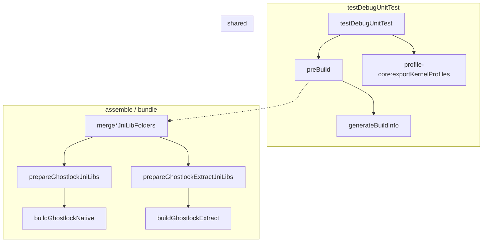

# app 单元测试与 arm64 native 构建解耦 计划（2026-10-01）

> 历史记录：本文描述的是旧版 App 打包 Rust extractor 的计划与实测。2026-10-08 起，对应的 extractor Gradle 任务及 APK 打包依赖已移除；下文不代表当前构建配置。

## 现状与基线

- 分支 `very-not-stable-dev`；对象是根 `build.gradle.kts` 与 `app/build.gradle.kts`。
- `app/build.gradle.kts:165-169` 把两个 native 准备任务挂在 `preBuild` 上：

  ```kotlin
  tasks.named("preBuild") {
      dependsOn(rootProject.tasks.named("prepareGhostlockJniLibs"))
      dependsOn(rootProject.tasks.named("prepareGhostlockExtractJniLibs"))
      dependsOn(generateBuildInfo)
  }
  ```

- 这两个任务分别依赖 `:buildGhostlockNative`（`make -C src ghostlock`，需 NDK）与
  `:buildGhostlockExtract`（`cargo --target aarch64-linux-android`，需 Rust android std）。
- 因此纯 JVM 的 `:app:testDebugUnitTest` 也会触发 arm64 native 构建。实测
  `./gradlew :app:testDebugUnitTest --dry-run` 的任务图（节选）为：

  ```
  :buildGhostlockExtract SKIPPED
  :prepareGhostlockExtractJniLibs SKIPPED
  :buildGhostlockNative SKIPPED
  :prepareGhostlockJniLibs SKIPPED
  :app:generateBuildInfo SKIPPED
  :app:preBuild SKIPPED
  ...
  :profile-core:exportKernelProfiles SKIPPED
  :app:testDebugUnitTest SKIPPED
  ```

- 后果：开发机（尤其 amd64 的 Linux / Windows / Intel mac）若没有 NDK、没有
  `aarch64-linux-android` 的 Rust std（Homebrew rustc 缺），`preBuild` 失败 →
  所有 app 单元测试被挡住。
- `app/src/test/**` 中没有任何测试 `System.loadLibrary` / 依赖 `.so`（已 grep），
  该依赖对单元测试并非必要。

## 目标与约束

目标：`:app:testDebugUnitTest` 不再触发任何 arm64 native 构建；`assemble*` / `bundle*`
仍然会构建并打包 `.so`。

非目标：
- 不改任何测试代码、native 代码、profile 或 wire；
- 不改 native 任务本身（`buildGhostlockNative` / `buildGhostlockExtract` 的输入输出与实现不变）；
- 不改 `:profile-core:exportKernelProfiles`（`ExporterAgreementTest` 依赖它，保留 `Test.dependsOn`）。

## 改动清单

| 文件 | 改动 | 理由 |
|---|---|---|
| `app/build.gradle.kts` | `preBuild` 只保留 `generateBuildInfo`；把 `prepareGhostlockJniLibs` / `prepareGhostlockExtractJniLibs` 改挂到消费 JNI 的打包任务 `merge*JniLibFolders`（debug/release、androidTest 同名任务用 `tasks.matching` 覆盖） | 编译期需要 `BuildInfo.kt`，但单元测试不需要 `.so`；把 native 准备绑到真正会打包它的任务上 |
| `app/build.gradle.kts` | 保留 `tasks.withType<Test>().configureEach { dependsOn(":profile-core:exportKernelProfiles") }` | 导出 profile 是单元测试的真实前置 |

不改根 `build.gradle.kts` 的任务定义（`prepareGhostlockJniLibs` 等仍是可被依赖的独立任务）。

## 数据流/控制流差异

旧：`:app:testDebugUnitTest → :app:preBuild → buildGhostlockNative / buildGhostlockExtract`。
新：`:app:testDebugUnitTest → :app:preBuild → generateBuildInfo`（无 native）；
`:app:assemble* / bundle* → merge*JniLibFolders → prepareGhostlock*JniLibs → buildGhostlock*`。



不变量：
- `.so` 仍只打进 arm64-v8a APK/AAB，产出路径不变；
- native 任务的输入/输出、缓存键不变；
- `generateBuildInfo` 仍在编译前执行，`BuildInfo.kt` 仍每构建重写。

## 兼容性与回滚

- 纯构建接线改动，无运行时代码/格式变化。
- 回滚：把两个 `prepare*JniLibs` 重新挂回 `preBuild` 即可。
- 需要在有 NDK 的机器上验证一次 `assembleDebug` 仍能产出带 `libghostlock.so` /
  `libextract.so` 的 APK。

## 验证矩阵

| 批次 | 命令 | 预期 |
|---|---|---|
| 任务图 | `./gradlew :app:testDebugUnitTest --dry-run` | 不再出现 `buildGhostlock*` / `prepareGhostlock*`；仍有 `:profile-core:exportKernelProfiles` |
| 任务图 | `./gradlew :app:assembleDebug --dry-run` | 仍出现 `buildGhostlockNative` / `buildGhostlockExtract` / `prepare*JniLibs` |
| 单测 | `./gradlew :app:testDebugUnitTest` | BUILD SUCCESSFUL；无 native 构建日志 |
| 打包 | `./gradlew :app:assembleDebug` | BUILD SUCCESSFUL；APK 内含 `lib/arm64-v8a/libghostlock.so` 与 `libextract.so` |

## 明确保留

- native 任务实现、`profile-core:exportKernelProfiles`、`generateBuildInfo`；
- 任何测试代码与资源。

## 进度

- [x] 计划
- [x] 实施 `app/build.gradle.kts`：`preBuild` 只留 `generateBuildInfo`，两个 `prepare*JniLibs` 改挂 `merge*JniLibFolders` / `merge*NativeLibs`
- [x] `:app:testDebugUnitTest --dry-run` 无 `buildGhostlock*`；`:app:assembleDebug --dry-run` 有
- [x] `:app:testDebugUnitTest` BUILD SUCCESSFUL（无 native 构建）
- [x] `:app:assembleDebug` BUILD SUCCESSFUL；APK 内含 `lib/arm64-v8a/libghostlock.so` 与 `libextract.so`
