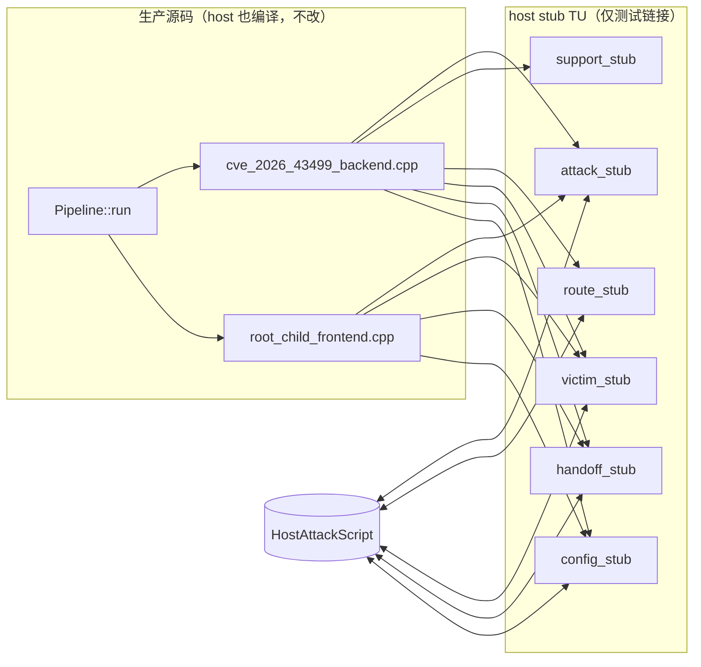

# host 执行数据流测试 计划（2026-10-01）

## 现状与基线

- 执行数据流入口是 `runtime::Pipeline<F,B,M>::run`（`route/pipeline.hpp`）：先
  `Backend::run<M>`（`cve_2026_43499_backend.cpp` 的 W1→W2/W3 chain），再把
  `VictimChain` 交给 `Frontend::run`（`root_child_frontend.cpp` 的 handoff）。
- 这些步骤直接调用副作用原语（真执行 / 真内核 / 真子进程）：
  `attack::*`、`support::prepare_good_kernel_page`、`route::middleware::run_middleware_route`
  （真 PI race）、`victim::spawn_victim`（fork）、`victim::verify_*`、
  `handoff_probe_run`、`config::runtime_config_snapshot()`。
- host 侧目前只有 `backend_contract_test`（只验证 concept）与
  `component_catalog_test`，**没有任何测试执行 `run<M>`**。
- 约束（AGENTS.md）：核心路径改动必须 `cmp_disasm` 8 函数；只有
  `g_exploit_session` 一个可变全局；`ExploitSession` 字段布局固定；PI 窗口不得引入
  间接分派。

## 目标与约束

目标：在 host 上把整个执行**数据流/控制流**跑通并可断言——W1→W2/W3 chain→handoff
一直到 `RunResult::Completed`——同时把真实执行原语换成 nop、`verify*` 与 route 结果可脚本化。

非目标：
- 不改 Android 核心路径的任何源码（`attack/`、`route/`、`session/` 的生产 TU 不动），
  因此 Android 二进制不变、`cmp_disasm` 天然 IDENTICAL；
- 不新增生产可变全局、不改 `ExploitSession` 字段布局；
- 不在 host 上做任何真实内核写入、fork 真实受害进程或装载 KernelSU。

## 设计：链接期 stub（不改核心路径源码）

host 测试直接编译**未修改**的 `cve_2026_43499_backend.cpp` 与
`root_child_frontend.cpp`，然后**用 host stub 替换**它们依赖的副作用 TU（ODR 替换）。
生产源码里调用什么符号，stub 就提供同名同签名的实现；Android 构建完全不链接这些 stub。

**脚本 API（`tests/host/host_attack_script.hpp`，host-only）**
- `verify_w2 / verify_selinux / verify_seccomp / verify_leaf`：`std::deque<int32_t>`，每次
  `verify_*` 弹出下一个结果（空队列时取 `default`）。
- `attack_write_status`：`std::deque<Status>`，控制每次 `run_middleware_route` 的返回
  （默认 `ROUTE_OK`）。
- `spawn`：`std::deque<{pid, task}>`，控制每次 `spawn_victim`。
- `handoff_ready`：bool，控制 `handoff_probe_run().ready()`。
- 记录器：`std::vector<std::string>` 调用序列，供断言数据流顺序/次数。

脚本对象是 stub TU 内部的一个 host-only singleton（只存在于测试二进制，不进生产）。
它不属于生产可变全局，故不违反 AGENTS 的全局约束。

**stub 清单**（按符号）

| stub TU | 提供的符号（生产调用点） | host 行为 |
|---|---|---|
| `attack_stub.cpp` | `in_direct_map` / `slab_drain` / `timer_*` / `install_profile` / `write_root_script` / `apply_iomem_cache` / `perf_find_task` | `in_direct_map`→true；其余 nop/固定值 |
| | `check_selinux_off` / `enforce_readable` / `process_has_seccomp` | 脚本化（selinux 用 `verify_selinux` 队列决定首次返回值） |
| `support_stub.cpp` | `prepare_good_kernel_page` / `discard_prebuilt_page` / `quarantine_reclaim_sockets` / `release_quarantined_reclaim_sockets` / `disable_rseq_for_thread` / `log_startup_context` / `init_p0_profile` | 假页指针 / 恒 true / nop |
| | `kernel::set_unbuffer/set_limit/pin_to_core` | nop |
| `route_stub.cpp` | `middleware::run_middleware_route` / `reserve_standard_io` / `do_*_fake_lock_route` | 返回脚本化 `RouteStatus`；nop |
| `victim_stub.cpp` | `victim::spawn_victim` / `verify_selinux_stage` / `verify_w2_stage` / `verify_seccomp_probe_stage` / `verify_leaf_dir_stage` | 假 {pid,task}；从脚本队列返回 |
| `handoff_stub.cpp` | `handoff_probe_run` / `kernelsu_module_visible` / `ksu_root_owned` / `scan_ksu_log` | `ready()` 按脚本；`ksu_root_owned`→false |
| `config_stub.cpp` | `config::runtime_config_snapshot()` | 返回默认 `RuntimeConfig`（不读环境） |

实链接（host 安全、无副作用）：`profile/model.h` 的 `TargetProfile`（测试用默认构造）、
`support/native_resource.cpp`（fd RAII）、`support/run_state.cpp`（纯状态）。
`victim_context.cpp` 若其方法在 host 只是 pid/fd 记账则实链接，否则一并 stub。

## 数据流/控制流差异

生产：`run<M>` 的每个 `verify`/`attack_write` 都触发真内核操作。
host：同一源码序列不变，只是这些调用落到 stub，返回脚本值；`run_state` 的
`enter/complete`、重试计数、W3 chain round、park、handoff 分支**全部真实执行**，
因此可断言数据流。

不变量：
- 生产源码零改动 → Android 构建与核心函数字节不变；
- `run<M>` 的语句顺序、日志文本、重试/回退逻辑不变；
- stub 只在测试链接集里出现。

## 所有权与生命周期追踪

- `ExploitSession`：测试栈上构造；`victim`/`heap`/`race`/`parked_*` 字段生命周期由
  session 本身给出（同 `exploit_session.hpp` 契约）。host 下 `race` 不启动真实线程、
  `victim` 不含真实 fd（stub 不写 fd）。
- `spawn_victim` stub：只返回值对象，不创建 fd/子进程 → 无需要回收的 OS 资源。
- `VictimChain`：栈上、单线程、backend 写 frontend 读，沿用现有契约。
- 假页指针（`prepare_good_kernel_page`）：不映射、不解引用，仅在 `attack_write` 里被
  `session.heap.current.base` 接住；route stub 不读它。
- 终结点：测试函数返回即全部结束，无悬空指针；stub singleton 为测试进程寿命。
- UAF：无新增堆分配与所有权转移，不引入 use-after-free。

## 兼容性与回滚

- 纯测试侧新增文件 + `src/Makefile` 目标；生产 `OBJS` 不变。
- 回滚：删除 `tests/host/**` 与 Makefile 目标即可。
- 需要一次 `make -C src native-host-tests` 确认既有 host 测试不受影响；Android 构建
  与 `cmp_disasm` 无需重跑（未触碰生产源码），但会跑一次 `make -C src ghostlock` 确认零告警。

## 验证矩阵

| 批次 | 命令 | 预期 |
|---|---|---|
| 数据流 | `make -C src host-attack-dataflow-test`（新目标） | W1→W2→W3→handoff 依脚本顺序执行，`RunResult::Completed` |
| 重试 | 同上（脚本 `verify_w2 = [0,0,1]`） | W2 恰好 3 次尝试后 `Rooted` |
| 回退/失败 | 脚本队列耗尽为默认失败 | 走到 `RunResult::Failed`，`stage` 正确 |
| 回归 | `make -C src native-host-tests` | 全绿 |
| 生产 | `make -C src ghostlock` | 零告警；未改生产源码 |

## 明确保留

- 生产 `attack/`、`route/`、`session/` 源码与 `ExploitSession` 布局；
- `cmp_disasm` 基线（本轮不因该改动触发，但按核心路径惯例保留）；
- `kernelsnitch/`、`LegacyProfileConverter.kt` 与"明确保留"清单。

## 进度

- [x] 计划
- [x] `tests/host/host_attack_script.hpp` + 各 stub TU（attack/support/route/victim/handoff/glue）
- [x] host 影子头 `tests/host/include/attack/ops.hpp` + 平台 shim（`linux/futex.h`、`linux/memfd.h`、`sys/prctl.h`、`sched.h`）
- [x] `src/Makefile` `host-attack-dataflow-test` 目标（生产 backend/frontend 未改动）
- [x] 测试用例：happy / W2 重试 / W2 耗尽 / SELinux 重试
- [x] 验证：`make -C src host-attack-dataflow-test` 输出 `backend_dataflow_test: ok` 且 exit 0；`make -C src native-host-tests` 全绿
- 说明：未改任何生产源码，故 Android 构建与 `cmp_disasm` 不受影响（无需重跑）
