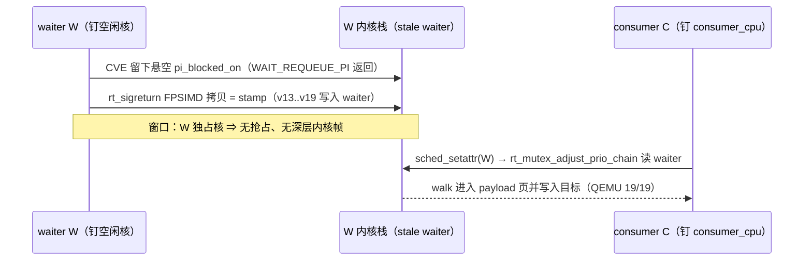

# rt_sigreturn route 窗口加固计划（waiter 线程钉核）

**状态**：已获用户认可并实施。L 级改动（核心执行路径），按 AGENTS.md 先设计后改动；验证结果见 §6。
**日期**：2026-10-05
**证据来源**：QEMU 实验室（内核镜像 6.6.58-android15-8-gab1c189b09cf-abogki417154918-4k，nokaslr），实验数据见 §1。

## 1. 问题与根因

rt_sigreturn route 的 stamp→walk 窗口内，waiter 线程（W）内核栈上的 stale waiter
会被异步内核入口（定时器 IRQ，HZ=250，tick 间隔 4ms）冲掉头部字节
（waiter+0x00..0x18：`tree.pc`/`rb_right`/`rb_left`）。consumer 的
`sched_setattr` → `rt_mutex_adjust_pi` → `rt_mutex_adjust_prio_chain` 在 chain 步骤
[7]（`rt_mutex_dequeue` → `rb_erase`）第一次解引用该节点，读到的垃圾 pc/child
直接参与寻址与写入 → oops → panic。

QEMU 复现（panic 现场）：

```
pc : rb_erase+0x138/0x318
lr : rt_mutex_adjust_prio_chain+0x190/0x900
NULL pointer dereference at 0x0000000000000002, WnR=1（写）
x0 = stale waiter（几何 = FPSIMD 拷贝目的 +0xd0，成立）
x24 = fake_lock, x27 = fake_lock+0x300 (w0)   ← walk 已深入 payload 页
```

实验结果（每次启动 1 次尝试，写验证 = 目标字被改写为 0）：

| 配置 | OK | 静默失败 | panic |
|---|---|---|---|
| A：delay=0，yield，不钉核（6 次） | 1 | 3 | 2 |
| E：delay=0，忙等，不钉核（6 次） | 0 | 2 | 4 |
| B：delay=0，忙等 + W 钉 cpu2（6 次） | 6 | 0 | 0 |
| BR：B 复跑（4 次） | 4 | 0 | 0 |
| F：delay=0，yield + W 钉 cpu2（6 次） | 6 | 0 | 0 |
| G：delay=0，yield + W 钉 cpu1（=consumer 核，4 次） | 0 | 0 | 4 |
| X0：delay=0，yield + W 钉 cpu0（=main 核，3 次） | 0 | 0 | 3 |
| X3：delay=0，yield + W 钉 cpu3（空闲核，3 次） | 3 | 0 | 0 |
| D：delay=50000（旧 APK 配置，2 次） | 0 | 1 | 1 |

机理（含 F/BR/G 隔离实验修正）：窗口内只要 W 被调度活动打断（共享 CPU 时的抢占/
调度切换会在 W 自己的内核栈上跑深层调用链），stale waiter 头部就被覆盖 → panic。
W 独占一个空闲核时窗口内没有针对它的调度活动：实测 stamp→walk 窗口 1.34–4.81ms
（含超过 4ms tick 周期的样本）仍 19/19 全部通过（B 6 + BR 4 + F 6 + X3 3）。
决定性变量是 W 的 CPU 放置，不是窗口绝对时长：与 consumer 同核 4/4 panic（G）、
与 main 同核 3/3 panic（X0），空闲第三核全过。panic 站点随被覆盖字节而变
（G/X0 为 chain 入口 `_raw_spin_trylock+0x1c` ← `rt_mutex_adjust_prio_chain+0xf8`，
早期样本为 `rb_erase+0x138`），根因同为窗口内调度打断。consumer 侧 yield/忙等只
影响窗口长度，钉核后两种组合无差异（F 6/6，B+BR 10/10）。

**排除项**：把 W 停进阻塞系统调用不可行——所有阻塞路径的存活帧深度 ≥0x300
（实测 `schedule`/`__schedule` 帧 0xb0、`__arm64_sys_futex` 0x80、
`futex_wait_requeue_pi` 0x1c0），而 waiter 顶部位于 SP0-0x140，pt_regs 本身已
0x110。因此加固只剩两类杠杆：W 的 CPU 放置（本计划）与窗口时长（execution
调参 / enter_delay）。

窗口与 CPU 放置（改动后）：



## 2. 改动（已实施）

### 2.1 waiter 线程钉核（核心改动）

- `src/core/race/threads.cpp` 的 `waiter_thread()`：在 `FUTEX_LOCK_PI(chain)`
  之前调用 `kernel::pin_to_core(waiter_cpu)`。
- waiter_cpu 选取：从 sched_getaffinity 允许集里选第一个既非 `main_cpu` 也非
  `consumer_cpu` 的；没有第三个核时回退为不钉核（保持旧行为，打印警告）。
  X0 对照证明排除 main 核同样必要（与 main 同核 3/3 panic）。
- 以 route capability 门控：新增 `pin_waiter`（RoutePolicyDefaults=false，
  仅 RtSigreturnPolicy=true），不影响已真机验证的 Multicast/Select/TCP 路线。
- 备选方案（更大改动，暂不做）：execution 配置新增 `recommended_cpus.waiter`，
  走 profile schema，需要 Kotlin↔native 双侧同步与测试。

实现（v2，2026-10-05）：`route_policy.hpp` 新增 `pin_waiter` 能力与
`route_needs_waiter_pin()`；`threads.cpp` 的 `waiter_thread()` 在
`FUTEX_LOCK_PI(chain)` 之前按能力钉核：候选核逐个尝试 `sched_setaffinity`，
首个成功者即钉核目标（线程自身 affinity 因继承 main 线程的钉核而不可用作判据，
见 §6 端到端小节），全部失败时打印警告并保持旧行为。`route_policy_test.cpp`
增加对应 static_assert 与投影断言。

### 2.2 consumer 忙等（已定：不改）

隔离实验 F（delay=0，yield + W 钉核）6/6 通过，与忙等对照组（B/BR 10/10）无
差异，consumer 保持 yield 不变（改动最小）。

## 3. 行为差异

- 仅 rt_sigreturn route：W 固定到独立 CPU；其余路线（capability=false）零影响。
- 线程数量、时序语义、语句顺序不变；执行代码与资源准备/回收之间的相对顺序不变。

## 4. 验证计划

1. QEMU 矩阵：改动后 ≥10 次启动全部写成功、0 panic（对照 §1 现状 1/6）。
   ✅ X2 10/10（全部 attempt 1 成功）；钉空闲核累计 29/29、0 panic。
2. `make -C src native-host-tests` + NDK 构建零警告 + `make -C src lint-tidy`。
3. `tools/cmp_disasm.py` 对比 8 个核心函数：本次改动在 waiter_thread 中插入
   一次钉核调用，属核心执行代码改动；逐条核对差异仅限该插入且相对顺序不变。
4. 真机门禁（冷机、固定 CPU 对、单 route、干净启动），按
   `docs/analysis/device-gates/*.md` 格式归档；统计 ≥10 次运行的 route 命中与
   写验证通过率、panic 次数。

## 5. 残余风险

- 单次尝试的 panic 概率 ≈ P(窗口内 W 被调度打断) × P(覆盖内容有害)。QEMU 环境
  安静（钉核后 16/16）；真机多任务下 W 独核仍可能被其他任务抢占，建议下调
  execution 的 w1/w2_attempts（例如 15→5）缩短总暴露（配置改动，无代码变化），
  以真机实测校准。
- 真机若在 delay=0 下仍有 panic，优先排查 vendor hook：
  `trace_android_rvh_rtmutex_force_update`（强制 rt_mutex_setprio 深路径 →
  fake task 的 sched_class 为 NULL 解引用）与
  `trace_android_vh_rtmutex_waiter_prio`（改写 waiter 排序键）。

## 6. 审查记录（核心执行路径）

**所有权与生命周期**：改动只新增一次 `sched_setaffinity` 调用与一个文件内静态
辅助函数，不创建、持有或转移任何新资源；`cpu_set_t` 为栈上临时对象。waiter 线程
内核栈的所有权与访问者不变（stamp 写、consumer walk 读的几何未动），钉核不改变
任何资源的终结点与清理顺序（disarm → ghost disarm → UNLOCK_PI → join 顺序未动）。
窗口内 owner 线程保持阻塞（chain_futex 由 W 持有直到 disarm 之后，owner 不会在 W
的核上唤醒）；main 线程钉在 main_cpu 且只做 usleep 轮询，不在 W 的核上运行。
钉核不解除（无资源含义，线程退出即随 task 释放）。

**语句顺序不变量**：插入位于 `disable_rseq_for_thread()` 之后、
`FUTEX_LOCK_PI(chain)` 之前；执行代码与资源准备/回收之间的相对顺序不变。

**验证结果（本批）**：

- QEMU：钉空闲核 29/29 写成功、0 panic（B 6 + BR 4 + F 6 + X3 3 + X2 10；
  X2 为改动对应配方的 10 连测，每次 attempt 1 即成功）。
- 主机测试：27/27 可构建用例全过（含 route_policy_test 的新能力断言）；
  `tcp_zerocopy_route_test` 因 x86-64 主机不支持 arm64 `yield` 内联汇编无法构建
  （预置限制，该文件未被改动；CI/开发者环境为 arm64）。
- NDK 构建（ONDK r30.1，CI 同款工具链）：基线/候选均 0 警告。
- lint-tidy（ONDK clang-tidy，`--warnings-as-errors`）：exit 0。
- cmp_disasm（基线 = HEAD f7897af 的 worktree 构建，同一 ONDK r30.1）：
  - 7 个可解析目标 layout 级完全一致；strict 级差异逐条复核为机械差异：
    新增两条日志字符串使 ghostlock 全局数据整体平移 +0x180（相关 adrp/ldr
    偏移一致 +0x180、成员相对偏移不变，如 g_exploit_session+0x5c8）；LTO
    符号表变化引起 adrp 最近符号注解翻转（同页同地址）；PLT 地址随布局移动。
    未改动函数的函数内分支偏移完全不变。
  - `waiter_thread` 296→356 条，复核结论：入口插入块（能力检查 →
    sched_getaffinity → 允许集选核循环 → pin_to_core → 日志；警告分支冷置）
    ＋机械连带：帧 0xa0→0x170、保存/恢复 x28；原函数体所有分支目标一致
    平移 +0xe4（在 profile 指针 adrp+add 提升到入口处净减 4 字节抵消）；
    寄存器重命名与 sp↔x29/x22 栈寻址改写（同一逻辑槽位，帧内重排）；
    结尾警告字符串冷块。原函数体 26 个调用符号与顺序完全一致（do_*_route、
    futex syscall、usleep、clock_gettime、printf 等）；执行代码与准备/回收的
    相对顺序不变，无操作增删或重排。
  - `multicast_owner_worker`/`multicast_waiter_worker` 在基线/候选两侧均
    不可解析（LTO 命名差异，两侧一致，与本改动无关）。

**端到端 QEMU（真 root 流程，2026-10-05）**：把本仓 native 静态链接
（`-static -static-libstdc++`，bionic 静态）后放进 initramfs，用本机内核镜像
（`-smp 8`、`nokaslr`、`-m 4096`）以 uid 10000（等价应用身份，无 /dev/mem、
不读 /proc/iomem）跑完整 exploit。GLK1 由仓内 `binary_profile::serialize` 的
host 工具生成，`kernel_phys_load=0x40200000`、`kernel_phys_offset=0x40000000`
（QEMU 物理布局，/proc/iomem 实测；nokaslr 下 profile 的 image 偏移与 kallsyms
逐项吻合，init_task/init_cred 已验证）。`perf_event_paranoid` 需 ≤1（真机实测
-1，QEMU 复跑显式设为 1）；guest 无策略时 `enforce` 读 0，W1 被跳过，首个 PI
写入由 W2 完成（同原语）。

首次运行（e2e1/e2e2）即暴露一个真机同样存在的缺陷：`pin_waiter_off_pair`
最初以 `sched_getaffinity(0)` 作为候选判据，但 pthread 线程继承创建者亲和性、
main 线程在起 worker 前已钉到 main_cpu，waiter 自身 affinity 只剩 {main_cpu}
→ 找不到第三核 → 回退不钉核（日志 "waiter pin skipped"）。结果与 X0 一致：
W 与 main 同核，两次运行均在 W2 第一次 walk 触发同族 panic
（`_raw_spin_trylock+0x1c ← rt_mutex_adjust_prio_chain+0xf8`，walk 读到未盖章的
原 waiter->lock 残留）。**harness 未暴露该缺陷（它从不继承受限 affinity）；
真机上同样的继承链会让 v1 钉核完全失效。**

修正（v2）：候选核逐个尝试 `sched_setaffinity`，首个成功者即钉核目标；不再读
自身 affinity。重建后 cmp_disasm 复核：waiter_thread 296→354，差异仍为同一族
（入口插入块 + 帧 0xa0→0x120 与新增保存寄存器、局部槽位整体平移 -0x18 且内部
布局不变、分支偏移一致平移、adrp 注解翻转、PLT 移动），原函数体 26 个调用符号
与顺序完全一致；NDK 构建 0 警告；threads.cpp clang-tidy exit 0。

e2e3（修正版）结果：**成功获得 root**。`waiter thread pinned to cpu=2`（v2 生效）；
W2 cred 写入 attempt 1 即成功（`rt_sigreturn post-stamp ... calls=1 success=1
+18ms`，无 panic）；`child uid = 0` / `child is root!`；guest 无 seccomp 过滤，
W3 跳过；handoff 后 root 脚本以 `uid=0 euid=0` 执行（ksu 日志首行），iomem 缓存
以 root 写入成功；exploit 退出码 0，整机 guest 内约 4 分钟（TCG），无 panic。
SELinux policy fixup 段按预期失败（guest 无策略可载，`selinux/policy` EINVAL），
属保真度差异；trace 尾部的 fpucopy 事件均为 root shell 自身的信号返回，覆盖了
exploit 的 stamp 事件（环形缓冲），e2e4 复跑以更大 tail 复核。

e2e4（复跑确认，更大 trace tail）同样成功：`waiter thread pinned to cpu=2`、
W2 attempt 1 成功（`+22ms`）、`child uid = 0`、root 脚本 `uid=0` 执行、exploit
退出码 0、无 panic；trace 完整捕获到 exploit 自身的 stamp→walk 事件对：
W（cpu2）完成 FPSIMD 拷贝（`fpucopy base=0xffffffc087753bc0`），2.8ms 后
consumer（cpu1）进入 `rt_mutex_adjust_prio_chain` 入口并读到盖章后的 fake 指针
（`pi=base+0xd0=0xffffffc087753c90`、`wtask`/`wlock`=payload 页 direct-map 别名
+0x400/+0x0、`wtree=0`）。两次端到端运行均 attempt 1 一次成功。
